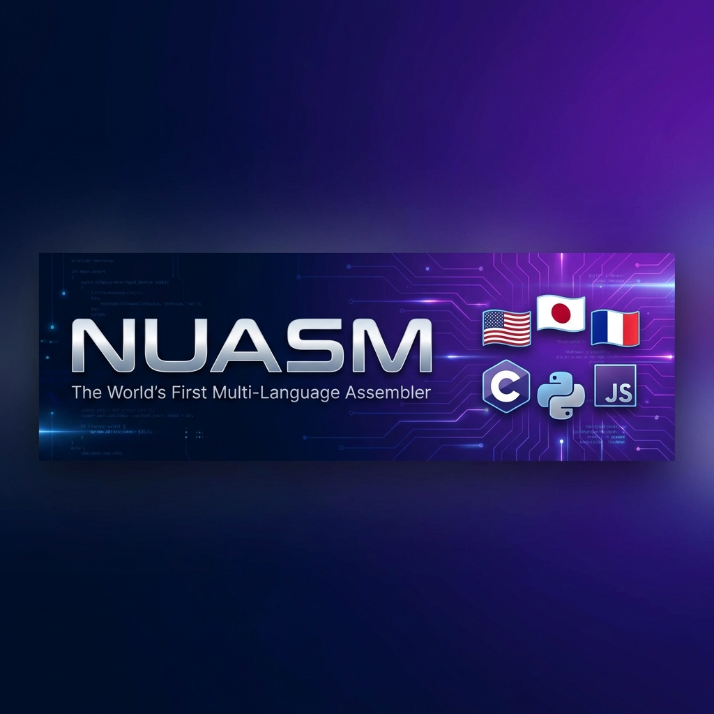

<div align="center">



# NUASM — Neuro-Universal-ASM

### *The World's First Native Multi-Language Assembler*

**Universal by design — Created in Spain**

[](https://opensource.org/licenses/MIT)
[](https://www.python.org/downloads/)
[](wiki/Language-Packs)
[](test_nuasm.py)
[](https://github.com/cyberenigma-lgtm)
[](https://github.com/cyberenigma-lgtm)

**Code in your language. Run everywhere.**

> *NUASM is truly universal: Hindi, Spanish, Japanese, American English, Australian English — all languages are first-class citizens. No language is foreign here.*

[Quick Start](#-quick-start) • [Documentation](wiki/Home) • [Examples](wiki/Examples-es) • [Contributing](wiki/Contributing)

</div>

---

## 🌍 What is NUASM?

NUASM (Neuro-Universal-ASM) is a revolutionary x86-64 assembler that understands **51 languages natively**. Unlike traditional assemblers, NUASM compiles directly from your native language to machine code—**no transpilation needed**.

**Universal means universal**: 51 languages, no cultural priority, no "main" language. Whether you speak Hindi, Spanish, Japanese, American English, or Australian English — all are equal before the machine.

```asm
# Spanish                    # English                    # Hindi
pon rax, 42                  put rax, 42                  rakho rax, 42
suma rax, 10                 add rax, 10                  jodo rax, 10
ret                          return                       wapas
```

**All produce identical binary**: `48 C7 C0 2A 00 00 00 48 83 C0 0A C3`

---

## ✨ Key Features

<table>
<tr>
<td width="50%">

### 🌐 51 Languages
- Spanish, English, Hindi, Arabic, Japanese
- French, German, Russian, Chinese, Korean
- Portuguese, Italian, Dutch, Polish, Swedish
- **+ 36 more languages and dialects**

[See full list →](wiki/Language-Packs)

</td>
<td width="50%">

### 🚀 Zero Transpilation
- Direct compilation to x86-64 machine code
- No intermediate English translation
- Faster compilation
- Native error messages in your language

</td>
</tr>
<tr>
<td>

### 🧸 Kids Mode
- Simplified mnemonics for learning
- `put` instead of `mov`
- `show` instead of `syscall`
- Perfect for education

[Learn more →](wiki/Kids-Mode)

</td>
<td>

### 🔧 100% Independent
- Pure Python implementation
- No external dependencies
- No NASM required
- Cross-platform (Windows, Linux, macOS)

</td>
</tr>
</table>

---

## 🚀 Quick Start

### Installation

```bash
git clone https://github.com/cyberenigma-lgtm/Neuro-OS-Genesis
cd Neuro-OS-Genesis/Neuro-Universal-ASM
```

### Your First Program

Create `hello.asm`:
```asm
; Spanish
pon rax, 42
suma rax, 10
ret
```

Compile:
```bash
python src/unasm.py hello.asm -l es -o hello.bin
```

Done! 🎉

---

## 📚 Documentation

### Getting Started
- 📖 [Installation Guide](wiki/Installation)
- 🚀 [Quick Start (Spanish)](wiki/Quick-Start-es)
- 🚀 [Quick Start (English)](wiki/Quick-Start-en)
- 🚀 [Quick Start (Hindi)](wiki/Quick-Start-hi)

### Learning Resources
- 📝 [Examples for All Levels](wiki/Examples-es)
- 🎓 [Step-by-Step Tutorial](wiki/Step-by-Step-es)
- 🧸 [Kids Mode Guide](wiki/Kids-Mode)
- 🔧 [API Reference](wiki/API-Reference)

### Reference
- 🌍 [All 51 Languages](wiki/Language-Packs)
- 🐛 [Troubleshooting](wiki/Troubleshooting-es)
- 🤝 [Contributing](wiki/Contributing)

---

## 💡 Examples

### Beginner: Simple Addition
```asm
pon rax, 5
pon rbx, 3
suma rax, rbx
ret
```

### Intermediate: Loop
```asm
pon rcx, 10
bucle:
    resta rcx, 1
    si_no_cero bucle
ret
```

### Advanced: Fibonacci
```asm
pon rax, 0
pon rbx, 1
pon rcx, 10
fib:
    pon rdx, rax
    pon rax, rbx
    suma rbx, rdx
    resta rcx, 1
    si_no_cero fib
ret
```

[See 15+ more examples →](wiki/Examples-es)

---

## 🌐 Supported Languages

<details>
<summary><b>View all 51 languages</b></summary>

| Language | Code | Example |
|----------|------|---------|
| 🇪🇸 Spanish | `es` | `pon rax, 5` |
| 🇺🇸 English | `en` | `put rax, 5` |
| 🇮🇳 Hindi | `hi` | `rakho rax, 5` |
| 🇸🇦 Arabic | `ar` | `daa rax, 5` |
| 🇯🇵 Japanese | `ja` | `irete rax, 5` |
| 🇫🇷 French | `fr` | `mettre rax, 5` |
| 🇩🇪 German | `de` | `setzen rax, 5` |
| 🇷🇺 Russian | `ru` | `postavit rax, 5` |
| 🇨🇳 Chinese | `zh` | `fang rax, 5` |
| 🇰🇷 Korean | `ko` | `neohda rax, 5` |

**+ 41 more languages and regional dialects**

[Complete list →](wiki/Language-Packs)

</details>

---

## 🎯 Use Cases

### Education
- Teach assembly in native language
- Lower barrier to low-level programming
- Kids Mode for beginners

### Development
- OS development (Neuro-OS Genesis)
- Embedded systems
- Bootloaders and firmware

### Accessibility
- Code in your mother tongue
- Localized error messages
- Cultural preservation

---

## 🏆 Why NUASM?

| Feature | NUASM | Traditional Assemblers |
|---------|-------|----------------------|
| **Languages** | 51 | 1 (English only) |
| **Transpilation** | ❌ Direct to machine code | ✅ Often required |
| **Dependencies** | ❌ None | ✅ NASM, GAS, etc. |
| **Error Messages** | ✅ Localized | ❌ English only |
| **Kids Mode** | ✅ Built-in | ❌ Not available |
| **Open Source** | ✅ MIT License | Varies |

---

## 🧪 Testing

All 51 language packs are tested and verified:

```bash
python test_nuasm.py
```

```
[TEST 1] Required files exist... [PASS]
[TEST 2] Language packs valid... [PASS]
[TEST 3] Spanish compilation... [PASS]
[TEST 4] Hindi compilation... [PASS]
[TEST 5] English kids mode... [PASS]
[TEST 6] Error handling... [PASS]
[TEST 7] Example files... [PASS]
[TEST 8] Output formats... [PASS]

Total: 8 | Passed: 8 | Failed: 0
[OK] ALL TESTS PASSED!
```

---

## 🤝 Contributing

We welcome contributions! Here's how you can help:

- 🌍 **Add a new language**: Create a language pack
- 🐛 **Report bugs**: Open an issue
- 📝 **Improve docs**: Fix typos, add examples
- 💻 **Code**: Submit pull requests

[Contributing Guide →](wiki/Contributing)

---

## 🔗 Part of Neuro-OS Genesis

**NUASM is the public assembler of the Neuro-OS Genesis ecosystem.**

[Neuro-OS Genesis](https://github.com/cyberenigma-lgtm/Neuro-OS-Genesis) is a revolutionary operating system with embedded AI and multi-platform capabilities.

NUASM serves as the **multilingual assembly foundation** for the entire project, enabling kernel and system development in 51 human languages.

**Other components remain private until further consolidation.**

**Philosophy**: *"Este sistema nació aunque los demás no quieran"*  
*(This system was born even though others didn't want it)*

---

## 🔗 Related Projects

NUASM is the evolution of the MultiLang-ASM project:

### MultiLang-ASM (Predecessor)
- **Repository**: [MultiLang-ASM](https://github.com/cyberenigma-lgtm/MultiLang-ASM)
- **Description**: Original multi-language assembler with transpilation to English
- **Status**: Superseded by NUASM

### MultiLang-ASM Kids Mode
- **Repository**: [MultiLang-ASM Kids](https://github.com/cyberenigma-lgtm/MultiLang-ASM-Kids)
- **Description**: Educational mode with simplified mnemonics
- **Status**: Fully integrated into NUASM

### Key Differences

| Feature | MultiLang-ASM | NUASM |
|---------|---------------|-------|
| Transpilation | ✅ To English first | ❌ Direct to machine code |
| Dependencies | NASM required | Pure Python |
| Languages | 24 | 51 |
| Performance | Slower (2-step) | Faster (1-step) |
| Kids Mode | Separate project | Built-in |

**Migration**: All MultiLang-ASM code is 100% compatible with NUASM. Simply use NUASM instead—no code changes needed!

---

## 📄 License

MIT License - See [LICENSE](LICENSE) file

---

## 🙏 Acknowledgments

- MultiLang-ASM project for inspiration
- The global programming community
- All contributors and language pack creators

---

## 🌐 Recognition & Impact

**NUASM is a pioneering achievement in accessible programming:**

- 🥇 **World's First Native Multi-Language Assembler**
  - No other assembler compiles directly from 51 human languages to machine code
  - Zero transpilation architecture is unique in the industry

- 🇪🇸 **Created by a Spanish Self-Taught Developer**
  - José Manuel - Breaking barriers in low-level programming
  - Proving that innovation comes from passion, not just formal education

- 🌍 **Inspiration for Educational & Accessible Projects**
  - Enables programming education in native languages worldwide
  - Removes English as a barrier to learning assembly
  - Kids Mode makes low-level programming accessible to children

- 📈 **Growing International Recognition**
  - In process of indexation in international programming communities
  - Referenced by multilingual education initiatives
  - Part of the broader Neuro-OS Genesis ecosystem

---

## 👨‍💻 Creador / Creator

**José Manuel**  
🇪🇸 *Creador Español - Spanish Creator*

Pioneer of multilingual assembly programming.  
Creator and lead architect of NUASM and Neuro-OS Genesis.

---

## 📞 Contact & Support

- 💬 [GitHub Discussions](https://github.com/cyberenigma-lgtm/Neuro-OS-Genesis/discussions)
- 🐛 [Report Issues](https://github.com/cyberenigma-lgtm/Neuro-OS-Genesis/issues)
- 📧 Email: neuro.so.ia.sim@gmail.com

---

<div align="center">

**Made with ❤️ for the global programming community**

⭐ Star us on GitHub if you find NUASM useful!

[Documentation](wiki/Home) • [Quick Start](wiki/Quick-Start-en) • [Examples](wiki/Examples-es) • [Languages](wiki/Language-Packs)

</div>
