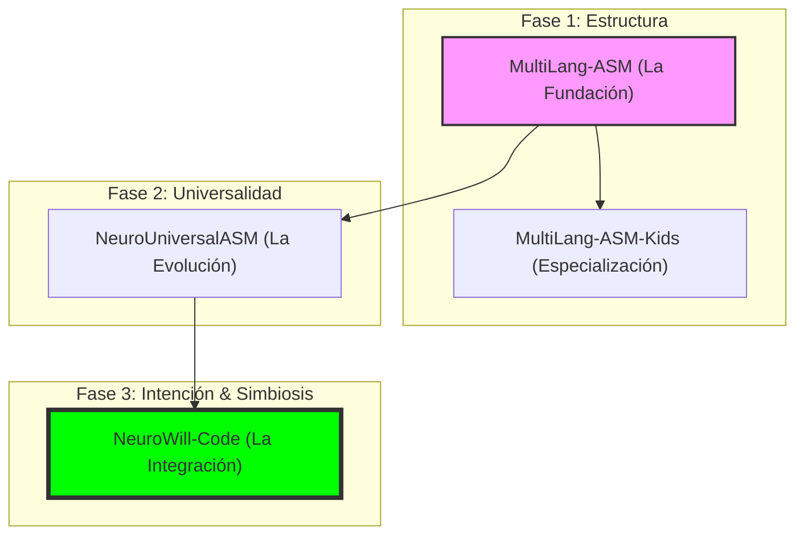

# Genealogía y Evolución: Ecosistema Neuro-ASM

Este documento detalla la transición técnica y conceptual entre los repositorios del ecosistema de ensamblaje cuántico-simbiótico de Neuro-OS.

## 🗺️ Mapa Evolutivo

La progresión desde el ensamblaje multilingüe básico hasta la inyección de intención directa en el silicio se resume en el siguiente diagrama:

---

## 1. MultiLang-ASM: La Piedra Angular
*   **Propósito**: Establecer la capacidad de manejar sintaxis de ensamblador en múltiples lenguajes naturales.
*   **Hito**: Fue el primero en demostrar que la "intención" del programador podía ser independiente del idioma (Español, Inglés, etc.).
*   **Legado**: Proporcionó los diccionarios léxicos y la lógica de mapeo que heredarían todos los demás sistemas.

## 2. MultiLang-ASM-Kids: Simplificación y Educación
*   **Propósito**: Derivado simplificado optimizado para el aprendizaje y para entornos con recursos limitados.
*   **Hito**: Implementó una sintaxis aún más amigable ("Kids") que serviría como base para los comandos semánticos de alto nivel.
*   **Relación**: Es una rama lateral diseñada para máxima accesibilidad.

## 3. NeuroUniversalASM (NUASM): El Núcleo Universal
*   **Propósito**: Evolucionar el motor de codificación (Encoder) para ser compatible con la arquitectura neuronal de Neuro-OS.
*   **Hito**: Introducción del soporte para x86-64 profesional y optimizaciones de latencia "zero-latency".
*   **Impacto**: Se convirtió en el motor estándar (backend) que traduce los opcodes finales.

## 4. NeuroWill-Code (NWC): El Puente de Voluntad
*   **Propósito**: Integrar todo lo anterior en un sistema de inyección directa al silicio ("Direct-to-Silicon").
*   **Innovación**: No solo ensambla código, sino que traduce la **Voluntad** (Will/Intención humana) directamente en ejecutable.
*   **Estado Actual**: Es la interfaz de alto rendimiento que utiliza Neuro-OS para su auto-expansión y simbiosis cuántica (DVTRGA v8.0).

---

## 🎯 Conclusión
La transición refleja un movimiento desde el **formato** (MultiLang-ASM) hacia la **intención pura** (NeuroWill-Code). Mientras que el primer repositorio se centraba en *cómo escribir* en varios idiomas, el último se centra en *qué se quiere lograr*, delegando la complejidad al núcleo cuántico de Neuro-OS.
